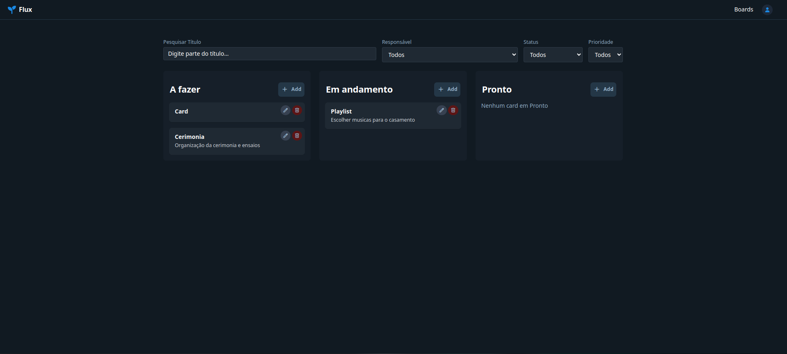

# Flux – Kanban Task Management

## Resumo do Projeto e Arquitetura

Flux é uma aplicação web de gerenciamento de tarefas em estilo Kanban, que permite aos usuários gerenciar quadros, tarefas e colaboradores:

* **Frontend (Angular 20)**: Aplicação SPA construída com Angular 20, utilizando Signals, directives nativas de fluxo de controle (`@if`, `@else`, `@for`) e o Angular CDK para arrastar e soltar cards (drag-and-drop).
* **Backend (Spring Boot)**: API REST em Java 21, organizada em módulos de **Board**, **Card** e **User**, com autenticação baseada em JWT e autorização RBAC (OAuth2 Resource Server).
  * **Arquitetura**: Feature-based com utilização dos princípios SOLID e DRY.
  * **Resiliência**: Rate Limiter e Circuit Breaker para prevenir ataques de Brute Force e DDoS bem como a exaustão dos recursos.
* **Banco de Dados (PostgreSQL)**: Armazenamento de usuários, boards, cards.
* **Docker Compose**: Orquestração dos contêineres de frontend, backend e banco de dados, facilitando o deploy local.


---
## Tecnologias Utilizadas

* **Frontend**

  * [Angular 20](https://angular.io/)
  * Angular CDK (DragDropModule).
  * Tailwind CSS e Flowbite (configuração básica para estilos de componentes).
  * RxJS (observables para chamadas HTTP).
  * Signals para gerenciamento de estado.
  * ngx-cookie-service (armazenamento de token JWT em cookie).
* **Backend**

  * [Spring Boot 3](https://spring.io/projects/spring-boot) (Java 21 / JDK 21)
  * Spring Security (OAuth2 Resource Server, JWT Bearer Tokens)
  * Spring Data JPA + Hibernate (persistência em PostgreSQL)
  * Lombok (redução de boilerplate)
  * Resilience4j (circuit breaker e rate limiter em pontos críticos)
  * Spring Actuator
  * Bean Validation
* **Banco de Dados**

  * [PostgreSQL](https://www.postgresql.org/)
* **Infraestrutura & DevOps**

  * Docker + Docker Compose
  * nginx (servendo build do Angular)
  * Maven (build do backend)
  * Node.js 20 / npm (build do frontend)
* **Documentação da API**

  * OpenAPI 3 (via dependência `springdoc-openapi-ui`)

---

## Como Rodar o Projeto Localmente

### Pré-requisitos

* Docker e Docker Compose instalados.
* Porta **8080** livre (backend), **4200** (frontend, se desejar rodar sem container), e **5432** (PostgreSQL).

### Passos

1. **Clonar o repositório**

   ```bash
   git clone https://github.com/marquesdavi/flux.git
   cd flux
   ```

2. **Configurar variáveis de ambiente (opcional)**

   O projeto já utiliza um `application.properties` padrão para conexão com PostgreSQL via Docker. Caso queira alterar, edite em `backend/src/main/resources/application.properties`:

   ```properties
   spring.datasource.url=jdbc:postgresql://postgres:5432/fluxdb
   spring.datasource.username=postgres
   spring.datasource.password=postgres
   spring.jpa.hibernate.ddl-auto=update
   ```

3. **Iniciar tudo via Docker Compose**

   Basta executar no diretório raiz (onde está o arquivo `docker-compose.yml`):

   ```bash
   docker compose up --build
   ```

   Isso irá:

   * Subir um contêiner `postgres:15` nomeado `flux-postgres-1` (banco de dados).
   * Buildar e subir o contêiner `flux-backend` na porta **8080**.
   * Buildar e subir o contêiner `flux-frontend` (nginx servindo build Angular) na porta **80** (ou **4200**, conforme configuração do `nginx.conf`).

4. **Verificar logs e acessos**

   * **Backend**:

     * Endpoints disponíveis em `http://localhost:8080/api/...`
     * Swagger UI (OpenAPI) em `http://localhost:8080/swagger-ui.html`
   * **Frontend**:

     * Abrir `http://localhost/` ou `http://localhost:80/board` (dependendo de roteamento) para acessar a aplicação Angular.

5. **Criar usuário e autenticar**

   * Acesse o frontend, clique em “Registrar novo usuário” (caso já exista fluxo de registro).
   * Após criar a conta e fazer login, você será redirecionado à lista de boards.

6. **Interagir com o sistema**

   * Crie um novo board, adicione cards, arraste-e-solte as tarefas entre “A fazer”, “Em andamento” e “Pronto”.
   * Clique no card para editar detalhes, atribuir responsável e convidar colaboradores à board.

---

## Telas do Sistema

### 1. Tela de Login / Registro


*Descrição: Usuário insere e-mail e senha para acessar. Se não tiver conta, pode navegar até “Registrar novo usuário”.*


---

### 2. Página de Listagem de Boards


*Descrição: Exibe todos os boards do usuário: aqueles que ele é owner ou colaborador. Botão para criar novo board no canto superior.*

---

### 3. Criar / Renomear Board


*Descrição: Input para criar novo board (“Digitar nome do quadro…”). Também é possível renomear boards existentes clicando no ícone de lápis.*

---

### 4. Modal de Gerenciamento de Colaboradores


*Descrição: Lista de colaboradores atuais, com botão para remover e campo para convidar novo colaborador via e-mail.*

---

### 5. Tela Kanban (Cards)


*Descrição: Quadro Kanban dividido em colunas “A fazer”, “Em andamento” e “Pronto”. Botão “Add” em cada coluna para criar novos cards.*

---

### 6. Modal de Edição de Card


*Descrição: Formulário para alterar título, descrições, datas, status, URL da imagem e atribuir responsável via dropdown de colaboradores.*

---

### 7. Configuração de Perfil


*Descrição: Formulário para alterar dados do usuário logado ou excluir conta no sistema.*

---
